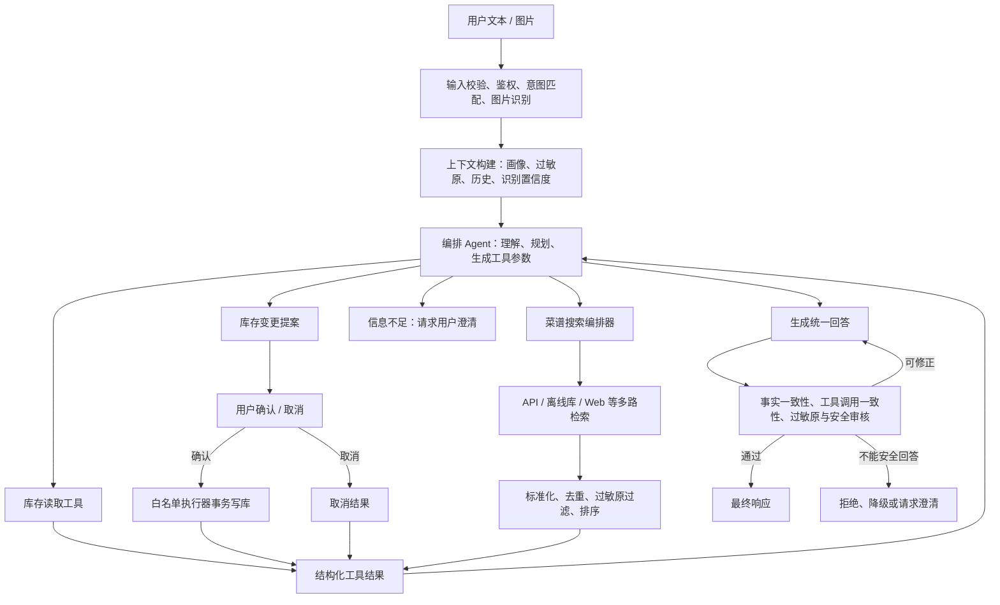

# Kitchen Inventory Agent

以 Python 和 LangChain 为核心的厨房库存 Agent

当前仓库实现以下链路：



## 目录

```text
app/             Python 主包
app/adapters/    外部 API 适配器
app/tools/       Agent 可调用工具
data/            SQLite 库存数据库及用户画像
frontend/        前端
scripts/         PowerShell 启动与停止脚本
tests/           测试
```

## 初始化

```powershell
python -m venv .venv
.venv\Scripts\Activate.ps1
pip install -r requirements.txt
Copy-Item .env.example .env
```

在 `.env` 中填写密钥后运行

启动展示页面：

```powershell
.\scripts\start.ps1
```

然后访问 `http://127.0.0.1:8000`

停止应用：

```powershell
.\scripts\stop.ps1
```
